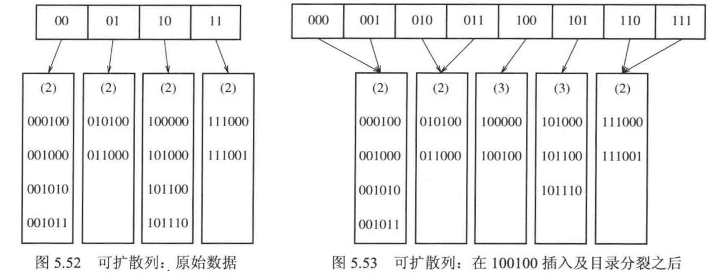
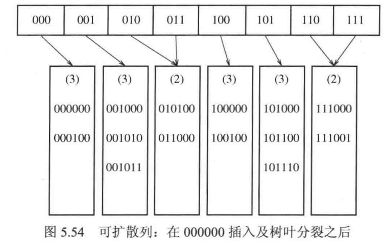

散列表：将map存入表容器中，可能会存在冲突  

## 解决冲突的第一种办法——分离链接法

将散列到同一个值的元素保存到一个链表里  

## 解决冲突的第二种办法——不使用链表的散列表

### 线性探测法

顺延冲突位置，甚至是回绕，直至找到空位。  
占据位置会形成区块，记作一次聚集，这会严重降低效率，理论计算如下：  
假设每次探测相互独立：设遇到已占位置的概率为 $`x`$，期望探测次数为 $`E`$，则有

```math
E = 1 + xE
```

得到

```math
E=\frac{1}{1-x}
```

设最终装填因子为$`\lambda`$，则从$`0`$开始充填的平均时间为

```math
I(\lambda)=\frac{1}{\lambda}\int_0^\lambda\frac{1}{1-x}\,dx
=\frac{1}{\lambda}\ln\frac{1}{1-\lambda}
```

显然，$`\lambda`$越接近1，插入所需时间就会越长，效率越低。

### 平方探测法

发生冲突时，依次顺延$`1^2,2^2,3^2...`$个位置
如果表有一半是空的，而且表的大小是素数，则保证总能插入一个新元素  
平方探测法的平均探测期望为

```math
E=\frac{1}{1-\lambda}
```

效率是高于线性探测法的  
注意：由于直接删除元素后再次查找元素较复杂，故采取通常懒惰删除  

### 双散列

构造两个散列函数，形如：

```math
hash_1(i)=i*hash_2(x)
```

显然$`hash_2(x)`$不要得到$`0`$，表的大小最好是素数。  
双散列法的探测期望是接近随机冲突解决方法的，即效率较高。

## $`O(1)`$访问散列表的方案

将$`N`$个球随机装入$`N`$个箱子里，则放球最多的箱子中球的个数期望为

```math
O(\frac{logN}{log(logN)})
```

即预期查询花费对数时间，我们希望得到$`O(1)`$的最坏情况开销。

### 完美散列

原理：大小为$`N^2`$的散列表，有至少$`\frac{1}{2}`$的概率不发生冲突，如果发生冲突，就尝试另一种散列函数，尝试期望至多为2。  
构造过程：  
先把$`N`$个元素分到$`N`$个桶中，允许冲突。  
再建立二级表，桶内有$`k`$个元素就分配$`k^2`$个位置。  
若二级表内发生冲突，则尝试其他散列函数，直至不发生冲突。  
若总的二级表太大，就重新选择主表。  

### 杜鹃散列

构造过程：  
随机取两个散列函数，构造两张散列表。  
计算元素的两个散列函数值，先尝试插入第一个散列表。  
若插入失败，则将冲突的元素放到第二张表去。  
若第二张表的元素发生冲突，则把冲突元素移到第一张表中。  
*由于第二张表的元素都是冲突后移动而来的，所以返回第一张表后必然引起冲突，但这不意味着插入失败，只需继续移动冲突位置*  
若出现循环移动，则判定为插入失败。  

优势：  
若装填因子$`\lambda<0.5`$，则发生循环概率极低，而且位置替换次数期望是一个很小的常数。  

### 跳房子散列

构造过程：  
主要思路与线性探测一致，区别在于插入位置必须在散列函数值的正向邻域内（邻域大小给定）。若空位太远，则搬动其他元素，让空位靠近，搬动元素也需要在自己的散列函数值附近。

## 通用散列

思路：准备一组散列函数，随机选一个来用。  
要求：记这组散列函数为$`H`$，桶数为$`M`$，$`h`$为$`H`$中的一个散列函数，则对于任意的$`x\neq y`$，

```math
P[h(x)=h(y)]\leq \frac{1}{M}
```

$`k`$通用散列，对于任意的$`x_1\neq y_1 ,..., x_k \neq y_k`$，

```math
P[h(x_1)=h(y_1) ,..., h(x_k)=h(y_k)] \leq \frac{1}{M^k}
```

举例：构造一个通用簇 $`H`$ （证明略），可将整数映射到$`[0,M-1]`$，其中 $`a`$ 和 $`b`$ 是随机选出的。

```math
H=\left\{
H_{a,b}(x)=((ax+b)\bmod p)\bmod M
\;\middle|\;
1\le a\le p-1,\quad 0\le b\le p-1
\right\}
```

例如，在这个函数簇中，$`a`$ 和 $`b`$ 的 3 个可能的随机选择产生 3 个不同的散列函数：

```math
\begin{aligned}
H_{3,7}(x)&=((3x+7)\bmod p)\bmod M\\
H_{4,1}(x)&=((4x+1)\bmod p)\bmod M\\
H_{8,0}(x)&=((8x)\bmod p)\bmod M
\end{aligned}
```

显然存在 $`p(p-1)`$ 个可以被选出的可能的散列函数。

## 可扩散列

为什么需要可扩散列？  
和B树的需求类似，磁盘访问成本高，因此需要减少磁盘访问。 
设有N个记录要储存，每个磁盘区块放M个记录。  
记存储的二进制数前缀为目录，目录最高有D位，则有$`2^D`$个目录项，不同目录项可以指向同一个桶（树叶）L。设桶的共同前缀长度为$`d_L`$，因此有$`d_L\leq D`$。  
当桶中元素个数超过M时，树叶发生分裂，如图所示：  




