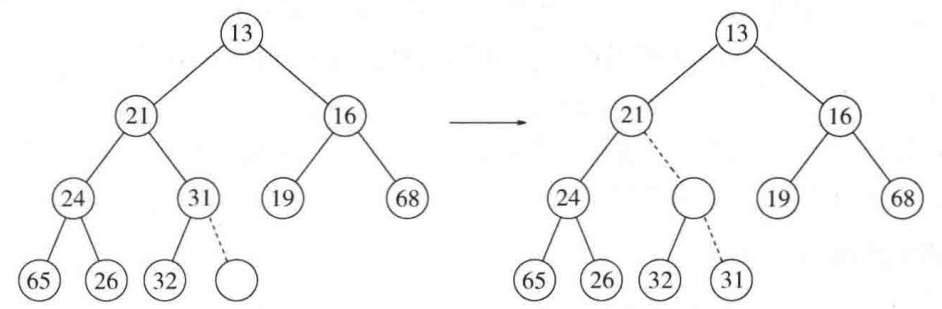
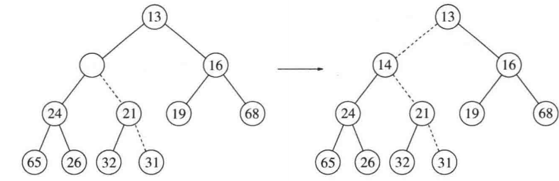
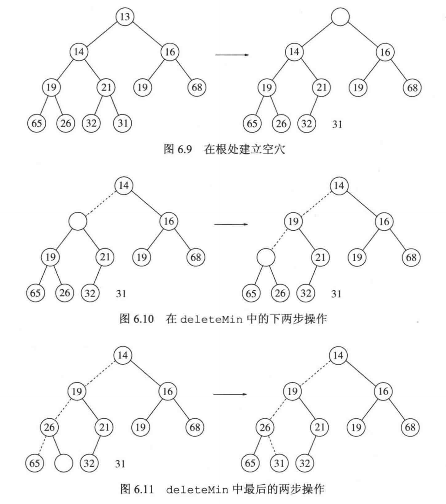

# 优先队列（堆）

## 6.1 模型

至少支持两种操作：insert 和 deleteMin。  
分别等价于队列中的enqueue 和 dequeue。  

## 6.3 二叉堆

### 结构性质

堆是完全二叉树，满足两个条件：

1. 除最后一层外，每层都填满。
2. 最后一层从左到右连续排列，中间不能空缺。  

因此在实现堆时，用数组存储数据。
比如，存储{1,2,3,4,5,6,7}

```text
        1
       / \
      2   3
     / \ / \
    4  5 6  7
```

对于节点$`i`$，其父节点是$`i/2`$，左孩子是$`2i`$，右孩子是$`2i+1`$

### 堆序性质

由于我们想要快速找到最小元，最小元应该在根上。  
因此，每个节点的元素应该小于其子节点的元素。  

### 插入

采取上滤策略，即先在最底部创建一个空穴，再反复将空穴上冒，直至找到合适插入位置，如图：





### 删除

采取下滤策略，即将根转换为一个空穴，然后逐个将孩子上移，直至符合堆的要求，如图：


