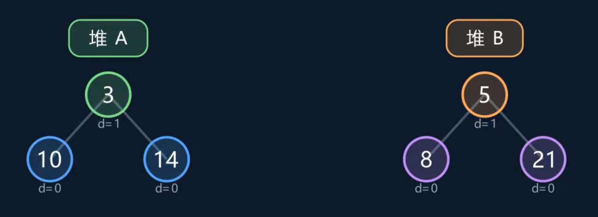
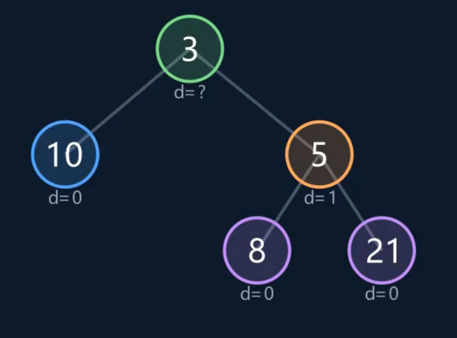
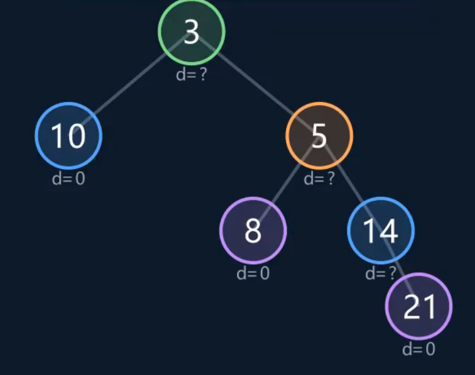
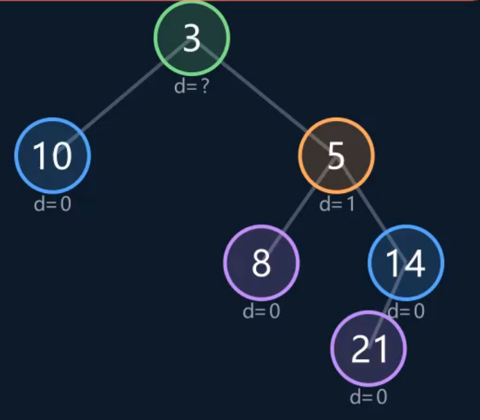
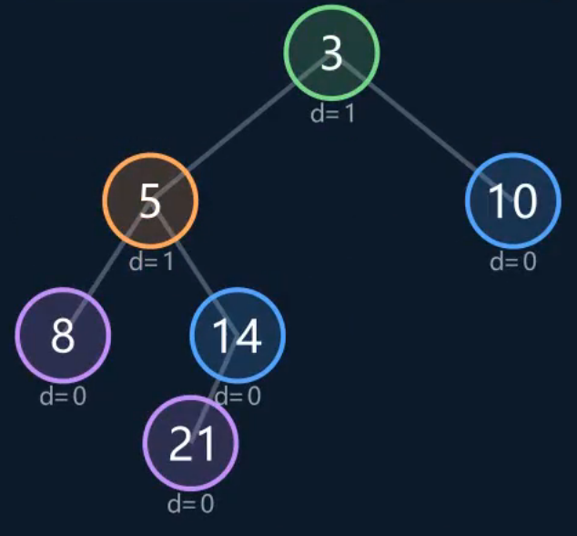
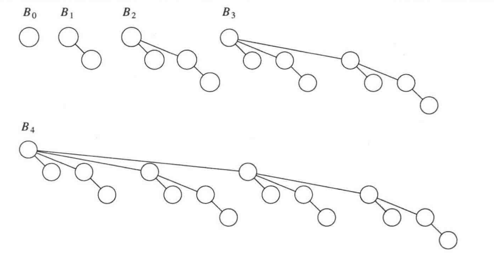
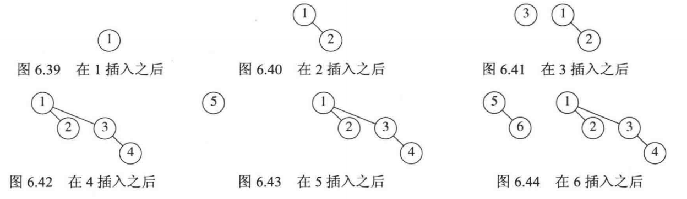
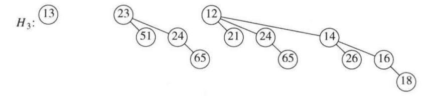
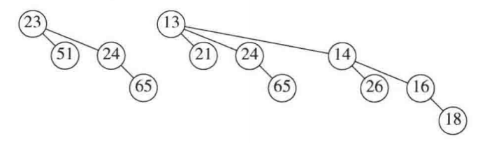
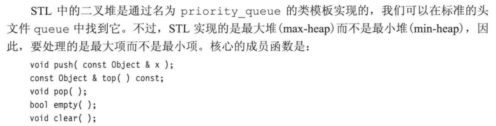

# 优先队列（堆）

## 6.1 模型

至少支持两种操作：insert 和 deleteMin。  
分别等价于队列中的enqueue 和 dequeue。  

## 6.3 二叉堆

### 结构性质

堆是完全二叉树，满足两个条件：

1. 除最后一层外，每层都填满。
2. 最后一层从左到右连续排列，中间不能空缺。  

因此在实现堆时，用数组存储数据。
比如，存储{1,2,3,4,5,6,7}

```text
        1
       / \
      2   3
     / \ / \
    4  5 6  7
```

对于节点$`i`$，其父节点是$`i/2`$，左孩子是$`2i`$，右孩子是$`2i+1`$

### 堆序性质

由于我们想要快速找到最小元，最小元应该在根上。  
因此，每个节点的元素应该小于其子节点的元素。  

### 插入

采取上滤策略，即先在最底部创建一个空穴，再反复将空穴上冒，直至找到合适插入位置，如图：


### 删除

采取下滤策略，即将根转换为一个空穴，然后逐个将孩子上移，直至符合堆的要求，如图：


## 6.4 堆的应用

寻找第$`k`$个最小元素，如果采取冒泡排序再检索，时间复杂度为$`O(N^2)`$。  
但如果我们使用堆排序，即先构建堆，再进行$`k`$次deleteMin函数，即可得到目标值。  先计算构建堆的时间：  
对于有 N 个结点的完全二叉树：  
约 (N/2) 个是叶子，不需要下滤。  
约 (N/4) 个最多下滤 1 层。  
约 (N/8) 个最多下滤 2 层。  
约 (N/16) 个最多下滤 3 层。  
...  
因此总时间为  

```math
\frac{N}{4}\cdot 1+\frac{N}{8}\cdot 2+\frac{N}{16}\cdot 3+\cdots
=\frac{N}{2}\sum_{h=1}^{\infty}\frac{h}{2^h}
=N
```

而对于deleteMin的时间：  
将最后一个元素放到根节点，下滤层数最多为$`logN`$。  
因此总的时间复杂度为$`O(N+klogN)`$，显然最坏运行时间是$`O(NlogN)`$。  

## 6.5 d堆

d堆是二叉堆的推广，一个节点有d个儿子，显然d堆比二叉堆要浅，因此insert函数进行要更快，但deleteMin函数进行会更慢，因为每次下滤的比较次数会更多。

## 6.6 左式堆

### 零路径长

$`npl(X)`$定义为从$`X`$到一个不具有两个儿子的节点的最短路径长。  
则$`X`$只有一个或没有儿子时$`npl(X)=0`$，定义$`npl(nullptr)=-1`$。
左式堆也具有结构性和堆续性，特征是

```math
npl(left)\geq npl(right)
```

其中$`left`$表示左儿子，$`right`$表示右儿子，因此我们也可以得到

```math
npl(X)=npl[X(right)]+1
```

因此，左式堆是一个不平衡的二叉树。  

**定理：对于一棵左式堆，右子树有$`r`$个节点，左子树至少有$`2^r-1`$个节点**  

左式堆被发明出来就是为了方便合并，普通的堆合并时间复杂度为$`O(N)`$，而左式堆为$`O(logN)`$，因为合并过程一直只在操作右子树，由定理知，右子树的节点数为$`O(logN)`$，因此合并的时间复杂度也为$`O(logN)`$。

### 合并过程

第一步：先比较两个堆的根元素大小，操作根元素大的堆，这里就是堆B



第二步：把根元素大的堆当做另一堆的右子树



第三步：把余出的的节点视作一个左式堆，与新的右子树合并，仍然是取代右子树



第四步：修复左偏性质，这里交换14的左右子树（nullptr与21）



第五步：继续修复左偏性质



## 6.7 斜堆

简化版的左式堆，即不记录$`npl`$有关的任何内容。除此之外，斜堆也具有父节点小于子节点的堆序性质。因此，它不保证每次运行时间都最短，最坏时间为$`O(N)`$。但摊还时间为$`O(logN)`$。  
斜堆的基本操作也是合并，每次合并都需要交换左右子树，防止一棵子树太长。 

## 6.8 二项队列

二项队列是一组堆序树（二项树），即森林。  
一棵高度为$`k`$的二项树$`B_{k}`$是由一棵二项树$`B_{k-1}`$附着到另一棵二项树$`B_{k-1}`$而成的。



显然，$`B_k`$的节点数为$`2^k`$，深度为$`d`$处的节点数为$`C_k^d`$.  

二项队列可用多个二项树表示:
例如 **5 个元素**：$`5=4+1`$，用 $`B_2+B_0`$ 表示。

```text
       B₂           B₀

        2            9
       / \
      5   4
      |
      8
```

例如 **6 个元素**：$`6=4+2`$，用 $`B_2+B_1`$ 表示。

```text
       B₂           B₁

        2            3
       / \           |
      5   4          7
      |
      8
```

每棵树都满足父结点不大于孩子，**不同树之间不要求有序**。

### 二项队列的操作

找出最小元素，显然时间复杂度为$`O(logN)`$.  
插入操作：类似于二进制加法，保持堆续性。



删除最小元素：这里最小元素是12，删除后让13接替12的位置





## 6.9 STL中的二叉堆


