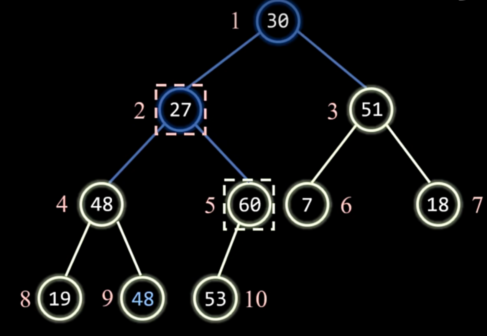
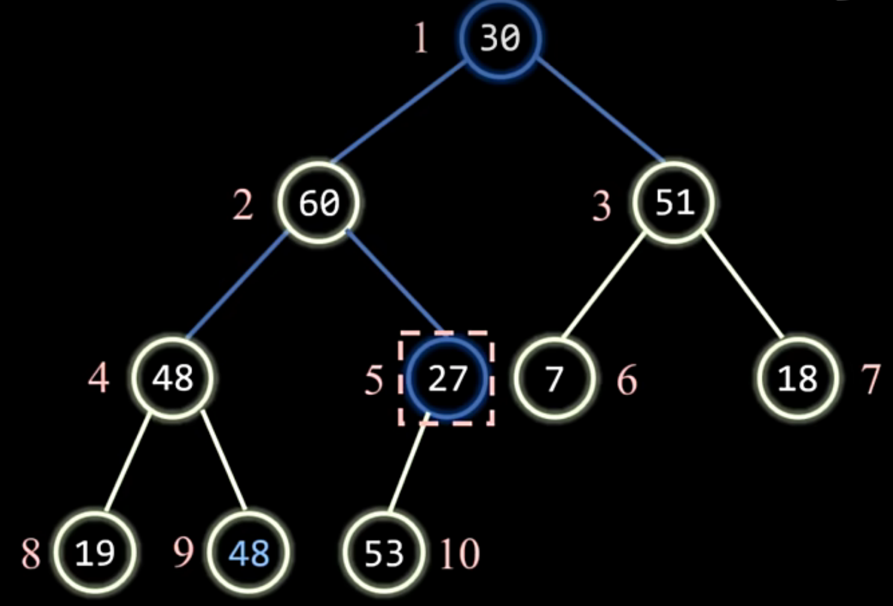
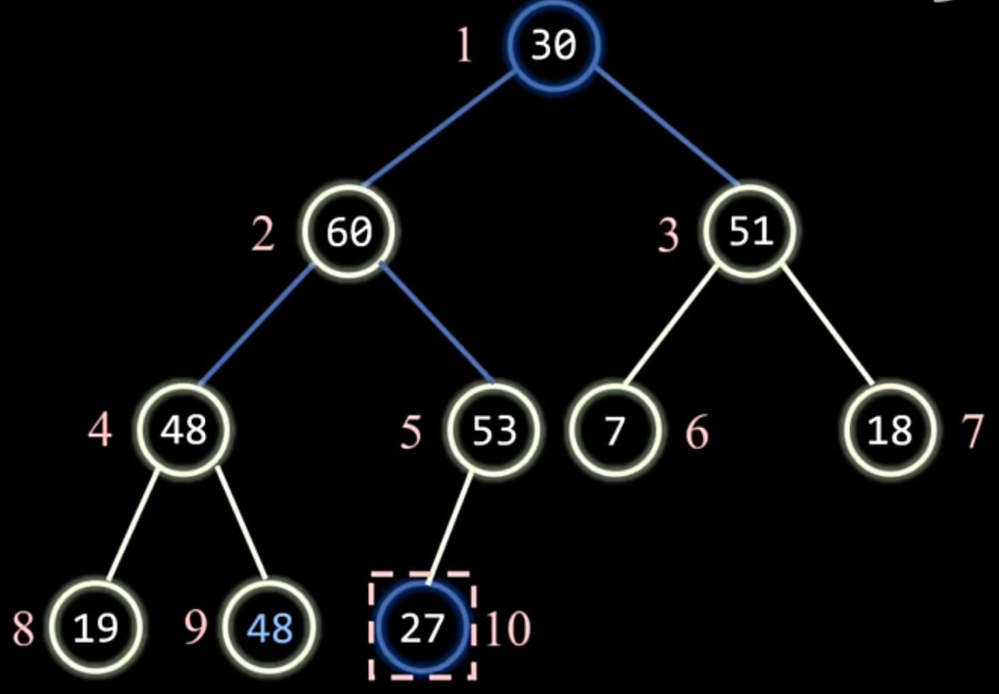
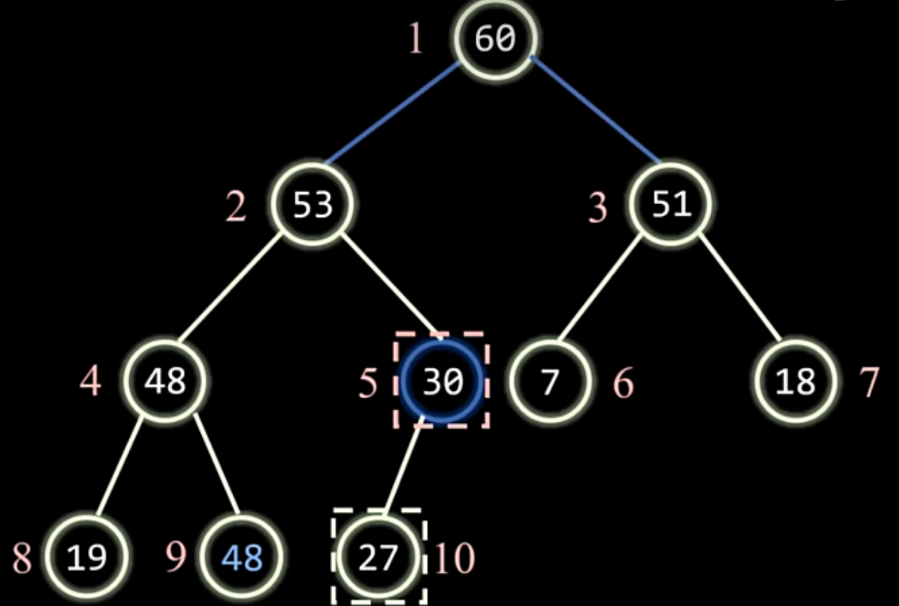
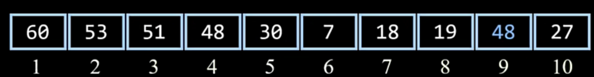
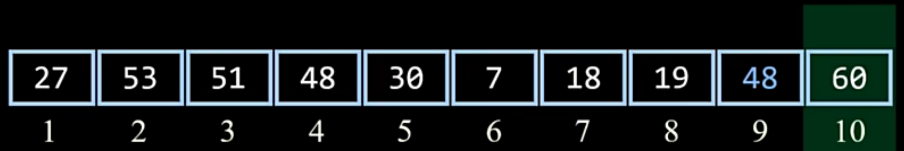
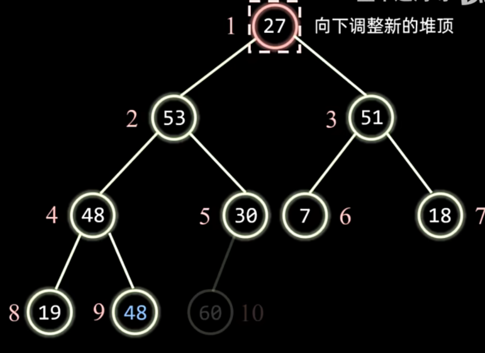
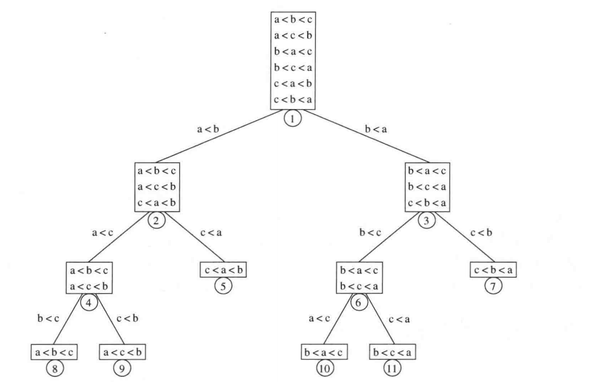

## 7.1 预备知识

STL中的排序算法：

```cpp
void sort ( iterator begin, iterator end );
void sort ( iterator begin, iterator end, Comparator cmp );
```
使用的算法是快速排序。

## 7.2 插入排序

原理：保证左边一部分序列已经有序，然后把右边的元素放到左边序列合适位置。
例如把 {5, 3, 4, 1} 按升序排列。用 `|` 分隔已排序和未排序的部分：

```text
初始：  [5 | 3, 4, 1]   第一个元素单独看，已经有序
第一轮：[3, 5 | 4, 1]   把 3 插入 5 前面
第二轮：[3, 4, 5 | 1]   把 4 插入 3 和 5 之间
第三轮：[1, 3, 4, 5 |]  把 1 插入最前面
```

具体怎样“插入”？以第二轮为例，此时数组是 [3, 5, 4, 1]：

1. 暂存 4，避免移动元素时把它覆盖。
2. 从有序区间的末尾向前比较：`5 > 4`，把 `5` 向右移动一格。
3. 继续比较：`3 < 4`，不用再移动。
4. 把暂存的 `4` 放进空出来的位置。

时间复杂度：最坏情况为

```math
\sum_{i=2}^{N} i = 1+2+3+4+\cdots+N = \Theta(N^2)
```

由于这个算法每轮都要操作一遍，所以最好时间复杂度是$`O(N)`$，平均时间复杂度是$`O(N^2)`$.  

## 7.3 简单排序算法的下界

对于 $`i<j`$ 且 $`a[i] > a[j]`$ 的序偶 $`(a[i],a[j])`$ 记作一个逆序。  
显然，对于插入排序，每次操作都会消除若干逆序，且操作数等于消除逆序数。  
设$`I`$为逆序数，则时间复杂度为$`O(I+N)`$，因为还有$`O(N)`$的其他操作（搬运临时变量）。而逆序数的期望值

```math
E(I) = \frac{N(N-1)}{4}
```

因此平均时间复杂度为$`O(N^2)`$.  
显然，对于任何交换实现的排序算法，时间复杂度均为$`\Omega(N^2)`$  

## 7.4 希尔排序

也叫缩小增量排序，本质上是插入排序的改进，利用了插入排序在整体数组比较有序的情况下时间较少的优点。  

每轮对由增量划分的小组进行插入排序，直到增量为1时对整个数组进行插入排序。  
一般取增量序列

```math
(\frac{n}{2},\frac{n}{4},\frac{n}{8}...1)
```

时间复杂度：  
最好情况$`O(N)`$  最坏情况$`O(N^2)`$  平均情况$`O(N^{1.3})`$  
但注意，希尔排序是不稳定的，即相同元素排序完成后相对位置可能发生变化。

## 7.5 堆排序  

以大根堆为例：（二叉树只是逻辑模型，实际上是用数组储存的）

### 1.建堆
  
从最后一个非叶节点（即最后一个节点的父亲）开始，倒着将每个节点为根的子树调整为堆。因为倒着来可以保证子树具有堆序性质。  

首先5号，4号和3号节点都满足堆续性，无需做调整。



然后我们发现2号节点不满足父亲大于儿子的性质，因此我们选择儿子中较大者与父亲做交换。



做交换后，我们发现5号节点的堆续性被破坏了，因此交换5号和10号节点。



现在2号节点也调整好了，调整根节点。和刚才一样，不断交换根节点和较大儿子。



现在二叉树已经调整为堆了，建堆完成。  

### 2.排序

只需将首元素（最大元素）和尾元素交换。





此时就可忽略10号元素，继续排序前9个元素。



此时由于其他子树都符合堆续性，因此只需将27向下调整即可完成建堆。

时间复杂度：  
建堆时间为$`O(N)`$，在6.4有相关证明。
后续每次向下调整的时间为$`O(logN)`$，需要向下调整$`N-1`$轮，因为最后一次不需调整。 因此总时间为$`O(NlogN)`$.  

堆排序不稳定，因为每个元素都会经历首尾互换，相同元素相对顺序会颠倒。

## 7.6 归并排序

将两个有序数组合并为一个有序数组的过程记作一次归并。  
归并排序就是两两归并（单个元素就是一个有序数组）。  
显然。每次都需要操作所有元素，需要操作$`O(logN)`$次，因此时间复杂度为$`O(NlogN)`$.  


## 7.7 快速排序

任意选择一个枢轴$`pivot`$，将数组中全部小于等于枢轴的元素放在其左边，大于枢轴的放在其右边。然后递归处理枢轴左右区间。  
平均时间复杂度$`O(NlogN)`$，空间复杂度$`O(logN)`$.
最坏时间复杂度$`O(N^2)`$，空间复杂度$`O(N)`$.  
快速排序是不稳定的。


## 7.8 排序算法的一般下界

前面我们研究的堆排序，归并排序，快速排序都是基于比较的排序算法。  
现在我们证明，基于比较的排序算法时间复杂度为$`\Omega(NlogN)`$.  
引入决策树的概念：



当有$`N`$个元素时，排列顺序有$`A_N^N`$种，每种情况视作决策树的一个叶子。  
显然，二叉树的高度就是$`O(logN!)`$.  


```math
\begin{aligned}
\log(N!)
&= \log\bigl(N(N-1)(N-2)\cdots(2)(1)\bigr) \\
&= \log N + \log(N-1) + \log(N-2) + \cdots + \log 2 + \log 1 \\
&\ge \log N + \log(N-1) + \log(N-2) + \cdots + \log(N/2) \\
&\ge \frac{N}{2}\log\frac{N}{2} \\
&\ge \frac{N}{2}\log N - \frac{N}{2} \\
&= \Omega(N\log N)
\end{aligned}
```
