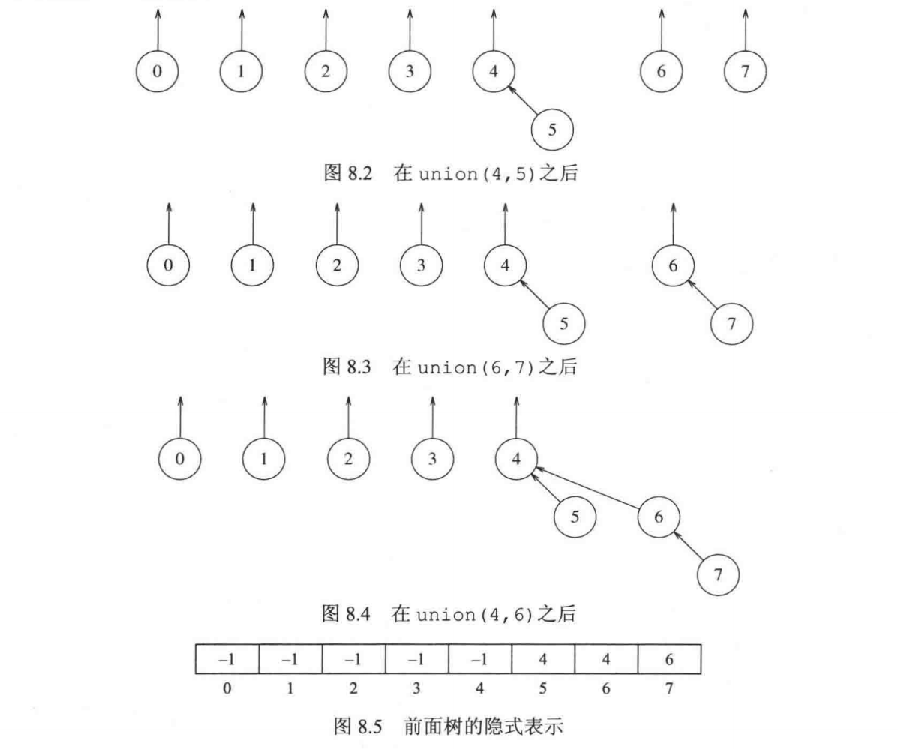
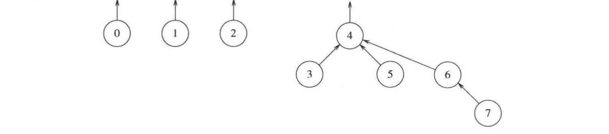

## 8.1 等价关系

关系：对于$`a,b\in S`$，$`aRb`$的值为true或false，若$`aRb = true`$，则称$`a`$和$`b`$有关系。  
等价关系：满足下列三个性质的关系$`R`$  
1. 自反性：$`a\in S,aRa`$.  
2. 对称性：$`aRb`$当且仅当$`bRa`$.  
3. 传递性：$`aRb`$且$`bRc`$，则$`aRc`$.  
举例：电气连通性  

## 8.2 动态等价性问题

设集合$`S`$，定义等价类为$`S`$的子集，其中包含的元素是有等价关系的。  
比如：对于自然数集，有以下等价类  
{0, 3, 6, 9, …}  余数为 0  
{1, 4, 7, 10, …} 余数为 1  
{2, 5, 8, 11, …} 余数为 2  
此时就有两种操作：  
1. find：返回包含给定元素的等价类  
2. union：如果我们想要添加关系$`aRb`$，那先用find判断$`a`$和$`b`$是否有关系。  
若没有关系，那就把返回的两个集合取并集。  
这套操作称为不相交集合的union/find算法。  

## 8.3 基本数据结构

我们用一个数组来表示如图所示的链表结构。  
数组中储存的值表示其父节点的下标，-1表示该位置的节点为根。  
当然，这个union过于随意了，可能导致树高过大。  

## 8.4 灵巧求并算法

算法一：按大小求并  
将节点数更多的树记作大树，我们总让小树的根连在大树的根上，如图所示：  

盯住某一个节点看：  
它在大树里：深度不变。  
它在小树里：深度增加 1，但合并后的树至少是原来大小的两倍。  
所以，它每加深一层，所在集合至少这样增长：  
节点深度： 0 → 1 → 2 → 3 → 4  
集合大小： 1 → 2 → 4 → 8 → 16  
因此，树的高度为$`O(logN)`$，这样就显著降低了树的高度。  

算法二：按高度求并  
将矮树的根接在高树的根上，也能保证树的高度为$`O(logN)`$.  

## 8.5 路径压缩

执行一次find(x)函数，将根到x的所有节点的父节点都改为根，比如：  
3 → 2 → 1 → 0（根）  
执行 find(3)，找到根 `0` 后，把沿途节点都直接连到 0：  
3 → 0   2 → 0   1 → 0
