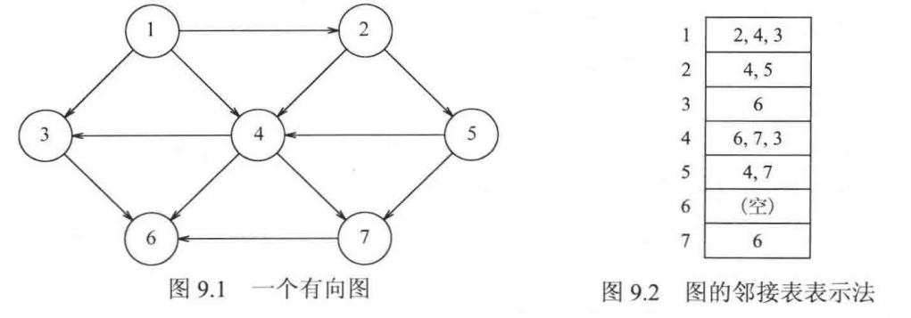

## 9.1 定义

一个**图**$`graph`$由**点**$`vertex`$集和**边**$`edge`$集组成：  

```math
G=(V,E)
```

每一条边是一个点对$`(v,w)`$，其中$`v,w\in V`$.  
若点对是有序的，则称图是**有向**的。  
$`w`$**邻接**到$`v`$当且仅当$`(v,w)\in E`$.  

**路径**：顶点序列$`w_1,w_2...w_i`$使得$`(w_i,w_{i+1})\in E`$.  
记边的数量为路径的长，只有一个点的路径的长为0.  
从一个顶点到它自身的边叫做**环**。  
满足$`w_1=w_N`$的边叫做圈。  
注意：在无向图中，$`u,v,u`$不是一个圈，因为$`(u,v)`$和$`(v,u)`$是一条边，但在有向图中它是一个圈。  
两两顶点之间存在路径的无向图是**连通的**，有向图是**强连通的**。  
一个有向图去掉箭头后的无向图即为**基础图**，若基础图是连通的，则该有向图是**弱连通的**。  
强联通的例子：  
A → B → C → A  
弱连通的例子：  
A → B → C  

**连通分量**是无向图中，一块“内部互相能到达、与外部不相连”的顶点集合。  
**图的表示**  
若图是稠密的即$`|E|=\Theta(|V|^2)`$，则适合用邻接矩阵表示，即二维bool数组。  
若图是稀疏的，则适合用邻接表法，空间复杂度为$`O(|E|+|V|)`$.  



## 9.2 拓扑排序

定义：满足一定元素先后顺序的排列，可能会有多种，因此必须是无圈图才有拓扑排序。  

## 9.6 深度优先搜索

从顶点$`v`$开始处理，递归遍历所有邻接$`v`$的节点。  
为了防止一个顶点被遍历多次，可以添加一个bool属性表示该点是否被遍历过，直到所有顶点都被标记过为止，总时间为$`O(|E|+|V|)`$.  
如果一次 DFS 没访问完所有顶点，说明图不连通。再从未访问的点开始，每次得到一棵树，合起来叫**深度优先生成森林**。
